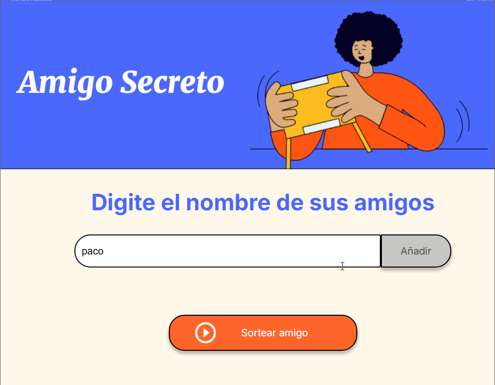
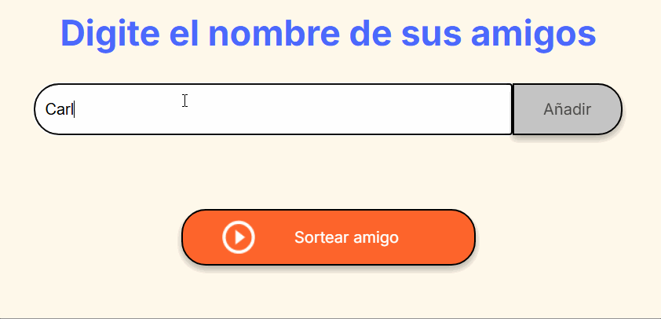
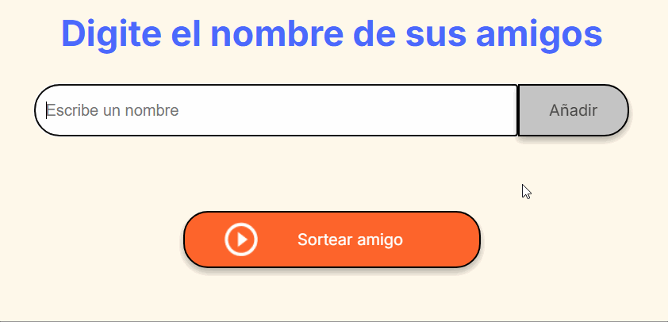
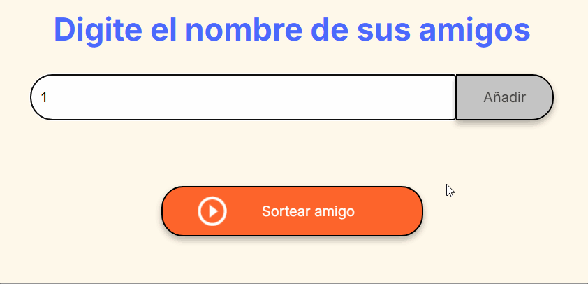

<!-- Improved compatibility of regresar al inicio link: See: https://github.com/othneildrew/Best-README-Template/pull/73 -->
<a id="readme-top"></a>
<!--
*** Thanks for checking out the Best-README-Template. If you have a suggestion
*** that would make this better, please fork the repo and create a pull request
*** or simply open an issue with the tag "enhancement".
*** Don't forget to give the project a star!
*** Thanks again! Now go create something AMAZING! :D
-->


<!-- PROJECT SHIELDS -->
<!--
*** I'm using markdown "reference style" links for readability.
*** Reference links are enclosed in brackets [ ] instead of parentheses ( ).
*** See the bottom of this document for the declaration of the reference variables
*** for contributors-url, forks-url, etc. This is an optional, concise syntax you may use.
*** https://www.markdownguide.org/basic-syntax/#reference-style-links
-->
[![Contributors][contributors-shield]][contributors-url]
[![Forks][forks-shield]][forks-url]
[![Stargazers][stars-shield]][stars-url]
[![Issues][issues-shield]][issues-url]
[![project_license][license-shield]][license-url]
[![LinkedIn][linkedin-shield]][linkedin-url]


<!-- PROJECT LOGO -->
<br />
<div align="center">
  <a href="https://github.com/ChangaRamirez/one-challenge-amigo-secreto">
    
  </a>

<h3 align="center">Amigo Secreto</h3>

  <p align="center">
    Sorteador de nombres desde una lista que el mismo usuario crea, con funcionalidades de formateo.
    <br />
    <a href="https://github.com/ChangaRamirez/one-challenge-amigo-secreto"><strong>Explora los documentos »</strong></a>
    <br />
    <br />
    <a href="https://github.com/ChangaRamirez/one-challenge-amigo-secreto">Ver Demo</a>
    &middot;
    <a href="https://github.com/ChangaRamirez/one-challenge-amigo-secreto/issues/new?labels=bug&template=bug-report.md">Reportar Un Bug</a>
    &middot;
    <a href="https://github.com/ChangaRamirez/one-challenge-amigo-secreto/issues/new?labels=enhancement&template=feature-request---.md">Solicitar Una Función</a>
  </p>
</div>


<!-- TABLE OF CONTENTS -->
<details>
  <summary>Tabla de Contenidos</summary>
  <ol>
    <li>
      <a href="#about-the-project">Acerca Del Proyecto</a>
      <ul>
        <li><a href="#built-with">Creado Con</a></li>
      </ul>
    </li>
    <li>
      <a href="#getting-started">Empezando</a>
      <ul>
        <li><a href="#prerequisites">Prerequisitos</a></li>
        <li><a href="#installation">Instalación</a></li>
      </ul>
    </li>
    <li><a href="#usage">Uso</a></li>
    <li><a href="#roadmap">Roadmap</a></li>
    <li><a href="#contributing">Contribuyendo</a></li>
    <li><a href="#license">Licencia</a></li>
    <li><a href="#contact">Contacto</a></li>
    <li><a href="#acknowledgments">Reconocimientos</a></li>
  </ol>
</details>


<!-- ABOUT THE PROJECT -->
## Acerca Del Proyecto


<!--Here's a blank template to get started. To avoid retyping too much info, do a search and replace with your text editor for the following: `ChangaRamirez`, `one-challenge-amigo-secreto`, `twitter_handle`, `linkedin_username`, `hotmail`, `laloraco`, `project_title`, `project_description`, `project_license`-->

### ¡Bienvenidos al Amigo Secreto más tecnológico!

Este proyecto nació de la brillante idea de demostrar cómo un poco de JavaScript puede hacer que nuestras navidades (o cualquier ocasión) sean mucho más divertidas... o algo más caóticas, dependiendo de quién te toque como amigo secreto. 🎁

Aquí, olvídate de escribir nombres en papelitos y hacer todo a mano, porque con solo unos clics podrás generar al azar quién será tu misterioso amigo secreto. El usuario ingresa los nombres en un input, y estos se almacenan mágicamente (bueno, con JavaScript y un poco de DOM) en una lista visible. Luego, con el botón de "Sortear Amigo", uno de esos nombres aparecerá de forma aleatoria, dejando el misterio en el aire.

Este proyecto no solo es útil para juegos de oficina, sino que también demuestra cómo trabajar con variables, arrays, loops, y cómo interactuar con el DOM. ¡Todo lo que necesitas para hacer magia en el mundo del desarrollo web!

Así que, ¿te atreves a descubrir quién es tu amigo secreto? Pero no olvides... no siempre es lo que parece. 👀


<p align="right">(<a href="#readme-top">regresar al inicio</a>)</p>


### Creado con

* [![JavaScript][JavaScript]][JavaScript-url]
<!--* [![Next][Next.js]][Next-url]
* [![React][React.js]][React-url]
* [![Vue][Vue.js]][Vue-url]
* [![Angular][Angular.io]][Angular-url]
* [![Svelte][Svelte.dev]][Svelte-url]
* [![Laravel][Laravel.com]][Laravel-url]
* [![Bootstrap][Bootstrap.com]][Bootstrap-url]
* [![JQuery][JQuery.com]][JQuery-url]-->

<p align="right">(<a href="#readme-top">regresar al inicio</a>)</p>

<!-- GETTING STARTED -->
## Empezando

Aquí van las instrucciones para poder visualizar el proyecto, ya sea desde un navegador web o si se desea, localmente desde tu computadora.
Para conseguir una copia local solo hay que seguir unos sencillos pasos.

### Prerequisitos

Realmente al ser un proyecto sencillo solo se requiere de un navegador web (yo utilicé Chrome v. 132.0.6834.160) y un editor de codigo para poder examinar los documentos. Pero basta con revisar el repositorio directamente desde [GitHub](https://github.com/ChangaRamirez/one-challenge-amigo-secreto) para explorar los documentos desde ahí =)

### Instalación

1. Clonar el repositorio
   ```sh
   git clone https://github.com/ChangaRamirez/one-challenge-amigo-secreto.git
   ```
5. Cambiar el git remote url para evitar pushes accidentales al proyecto base
   ```sh
   git remote set-url origin ChangaRamirez/one-challenge-amigo-secreto
   git remote -v # confirmar los cambios
   ```
<p align="right">(<a href="#readme-top">regresar al inicio</a>)</p>


<!-- USAGE EXAMPLES -->
## Uso

<div align=center></div>

 Este proyecto puede ser tu nuevo compañero en todas esas actividades donde el azar decide por ti... ya sea para elegir un amigo secreto, asignar tareas aleatorias o simplemente darle un toque de emoción a cualquier evento. Aquí te dejo algunas maneras de sacar el máximo provecho de esta herramienta:

### Sortear un amigo secreto
¿Estás organizando un amigo secreto para el cumpleaños de tu compañero de trabajo? ¡Este proyecto es para ti! Solo tienes que ingresar los nombres de todos los participantes en el campo de texto, darle al botón de "Sortear Amigo" y ¡listo! El sistema seleccionará un nombre de la lista al azar y lo mostrará en la pantalla. ¡Así de fácil!

### Generar tareas aleatorias
¿No te decides quién debe hacer qué en el equipo? Usa esta aplicación para asignar tareas al azar. Solo ingresa los nombres de todos los miembros del equipo, pon un nombre de tarea para cada uno y permite que el azar haga el resto. ¡Nunca más tendrás que tomar la decisión difícil de "quién hace qué"!

### Usar para actividades de grupo
¿Estás organizando juegos de grupo y necesitas asignar equipos o roles? Este proyecto puede ser útil para seleccionar equipos, asignar roles o hacer sorteos de cualquier tipo de forma rápida y divertida. Solo ingresa los nombres y deja que la magia de JavaScript haga el trabajo.

## Funciones útiles para formatear el input del usuario:
Este proyecto no solo te ayuda a sortear nombres, también asegura que los datos que ingreses estén correctamente formateados. Como buen proyecto de JavaScript, he incluido varias funciones que garantizan que tu experiencia sea limpia y sin errores.

### Eliminación de caracteres no alfabéticos
Si intentas ingresar algo como "Carlos123" o "@Sofía", el sistema eliminará cualquier carácter que no sea una letra, para asegurarse de que solo los nombres válidos se guarden. Nada de números ni símbolos raros se quedarán en la lista. 🧹



### Capitalización automática
No importa si escribes “juan pérez” o “MARÍA LÓPEZ”, el sistema automáticamente corregirá las palabras para que siempre empiecen con mayúscula, dándole un toque más elegante a los nombres. ¡Siempre con estilo! ✨



### Correción tras espacios o guiones
Para que todo se vea bien, he agregado una pequeña magia que también capitaliza las palabras que vienen después de los espacios o guiones. Así que no más "juan-pérez" o "maría lópez", sino "Juan-Pérez" y "María López". ¡Todo bien ordenado! 🔤



¡Y eso es todo! Ya estás listo para usar este proyecto y darle un toque de azar a tu día. ¡Espero que lo disfrutes tanto como yo al hacerlo!

<p align="right">(<a href="#readme-top">regresar al inicio</a>)</p>


<!-- ROADMAP -->
## Roadmap

Este proyecto ha ido evolucionando paso a paso, implementando mejoras en su funcionalidad y garantizando una mejor experiencia para el usuario. A continuación, se detallan las etapas clave del desarrollo:

### ✅ 1. Creación del array para almacenar nombres
El primer paso fue establecer la estructura base del proyecto mediante un array, donde se almacenarían los nombres ingresados por el usuario. Este array sería la fuente de datos para la funcionalidad principal del sorteo.

### ✅ 2. Implementación de la función para agregar amigos
Se desarrolló una función que permite al usuario ingresar nombres a través de un input, asegurando que cada nombre se almacene correctamente en el array.

### ✅ 3. Implementación de la función para actualizar la lista visual de amigos
Para mejorar la experiencia del usuario, se implementó una función que actualiza dinámicamente un elemento `<ul>` en la interfaz, reflejando en tiempo real los nombres ingresados.

### ✅ 4. Implementación de la función para sortear un amigo secreto
El núcleo del proyecto: una función que selecciona un nombre al azar del array de participantes y lo muestra en pantalla cuando el usuario presiona el botón "Sortear Amigo".

### ✅ 5. Implementación de funciones para limpiar el string ingresado
Se agregaron mejoras para garantizar que los nombres ingresados sean legibles y correctamente formateados, evitando inconsistencias en la lista.

### 📌 5.1 Eliminación de caracteres no alfabéticos
Una función que filtra y elimina cualquier carácter no alfabético del input del usuario, asegurando que solo se almacenen nombres válidos sin números, símbolos u otros caracteres no deseados.

### 📌 5.2 Capitalización de las mayúsculas en los nombres ingresados
Se desarrolló una función que ajusta automáticamente la capitalización de los nombres. Esto garantiza que cada palabra comience con mayúscula, incluyendo las que vienen después de espacios o guiones.

Este roadmap refleja el progreso del proyecto hasta ahora, pero siempre hay espacio para mejoras y nuevas funcionalidades. 🚀 ¡Seguiré trabajando para hacer que este Amigo Secreto sea aún más increíble!

<p align="right">(<a href="#readme-top">regresar al inicio</a>)</p>


<!-- CONTRIBUTING -->
## Contribuyendo

Las contribuciones son lo que hace que la comunidad de código abierto sea un lugar tan increíble para aprender, inspirar y crear. Cualquier contribución que hagas será **muy apreciada**.

Si tienes una sugerencia que pueda mejorar esto, por favor haz un fork del repositorio y crea un pull request. También puedes abrir un issue con la etiqueta "enhancement" (mejora). ¡No olvides darle una estrella al proyecto! ¡Gracias nuevamente!

1. Haz un fork del proyecto
2. Crea tu rama de características (git checkout -b feature/AmazingFeature)
3. Haz commit de tus cambios (git commit -m 'Añadir una AmazingFeature')
4. Sube a la rama (git push origin feature/AmazingFeature)
5. Abre un pull request

<p align="right">(<a href="#readme-top">regresar al inicio</a>)</p>

### Top contribuyentes:

<a href="https://github.com/ChangaRamirez/one-challenge-amigo-secreto/graphs/contributors">
  
</a>


<!-- LICENSE -->
## Licencia

Este proyecto es para uso personal y educativo exclusivamente. El uso comercial no está autorizado. Puedes leer más en [LICENCE.txt](LICENCE.txt)

<p align="right">(<a href="#readme-top">regresar al inicio</a>)</p>


<!-- CONTACT -->
## Contacto

Eduardo "Changa" Ramírez-García - laloraco@hotmail.com

Link del Proyecto: [https://github.com/ChangaRamirez/one-challenge-amigo-secreto](https://github.com/ChangaRamirez/one-challenge-amigo-secreto)

<p align="right">(<a href="#readme-top">regresar al inicio</a>)</p>


<!-- ACKNOWLEDGMENTS -->
## Reconocimientos

* [Alura LATAM](https://www.aluracursos.com/)
* [ONE - Oracle Next Education](https://www.oracle.com/mx/education/oracle-next-education/)
* [Othneil Drew (tu plantilla README.md me salvó)](https://github.com/othneildrew)

<p align="right">(<a href="#readme-top">regresar al inicio</a>)</p>


<!-- MARKDOWN LINKS & IMAGES -->
<!-- https://www.markdownguide.org/basic-syntax/#reference-style-links -->
[contributors-shield]: https://img.shields.io/github/contributors/ChangaRamirez/one-challenge-amigo-secreto.svg?style=for-the-badge
[contributors-url]: https://github.com/ChangaRamirez/one-challenge-amigo-secreto/graphs/contributors
[forks-shield]: https://img.shields.io/github/forks/ChangaRamirez/one-challenge-amigo-secreto.svg?style=for-the-badge
[forks-url]: https://github.com/ChangaRamirez/one-challenge-amigo-secreto/network/members
[stars-shield]: https://img.shields.io/github/stars/ChangaRamirez/one-challenge-amigo-secreto.svg?style=for-the-badge
[stars-url]: https://github.com/ChangaRamirez/one-challenge-amigo-secreto/stargazers
[issues-shield]: https://img.shields.io/github/issues/ChangaRamirez/one-challenge-amigo-secreto.svg?style=for-the-badge
[issues-url]: https://github.com/ChangaRamirez/one-challenge-amigo-secreto/issues
[license-shield]: https://img.shields.io/github/license/ChangaRamirez/one-challenge-amigo-secreto.svg?style=for-the-badge
[license-url]: https://raw.githubusercontent.com/ChangaRamirez/one-challenge-amigo-secreto/refs/heads/main/LICENCE.txt
[linkedin-shield]: https://img.shields.io/badge/-LinkedIn-black.svg?style=for-the-badge&logo=linkedin&colorB=555
[linkedin-url]: https://www.linkedin.com/in/ramirezpaints/
[product-screenshot]: images/screenshot.png
[JavaScript]: https://shields.io/badge/JavaScript-F7DF1E?logo=JavaScript&logoColor=000&style=flat-square
[JavaScript-url]: https://www.javascript.com/
[Next.js]: https://img.shields.io/badge/next.js-000000?style=for-the-badge&logo=nextdotjs&logoColor=white
[Next-url]: https://nextjs.org/
[React.js]: https://img.shields.io/badge/React-20232A?style=for-the-badge&logo=react&logoColor=61DAFB
[React-url]: https://reactjs.org/
[Vue.js]: https://img.shields.io/badge/Vue.js-35495E?style=for-the-badge&logo=vuedotjs&logoColor=4FC08D
[Vue-url]: https://vuejs.org/
[Angular.io]: https://img.shields.io/badge/Angular-DD0031?style=for-the-badge&logo=angular&logoColor=white
[Angular-url]: https://angular.io/
[Svelte.dev]: https://img.shields.io/badge/Svelte-4A4A55?style=for-the-badge&logo=svelte&logoColor=FF3E00
[Svelte-url]: https://svelte.dev/
[Laravel.com]: https://img.shields.io/badge/Laravel-FF2D20?style=for-the-badge&logo=laravel&logoColor=white
[Laravel-url]: https://laravel.com
[Bootstrap.com]: https://img.shields.io/badge/Bootstrap-563D7C?style=for-the-badge&logo=bootstrap&logoColor=white
[Bootstrap-url]: https://getbootstrap.com
[JQuery.com]: https://img.shields.io/badge/jQuery-0769AD?style=for-the-badge&logo=jquery&logoColor=white
[JQuery-url]: https://jquery.com 
